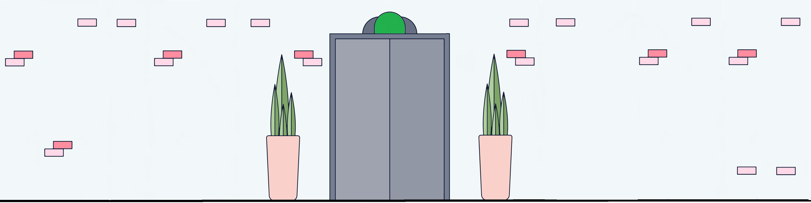
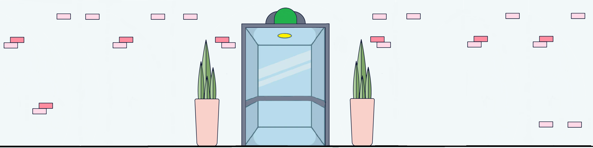

# Elevator Visma Bootcamp Assignment
This project was generated with [Angular CLI](https://github.com/angular/angular-cli) version 14.0.0.
## Development server
Run `ng serve` for a dev server. Navigate to `http://localhost:4200/`. The application will automatically reload if you change any of the source files.
## Description
This project is meant to simulate basic behaviour of an elevator. It consists of 2 components `FloorComponent` and 
`SettingsPanelComponent`.
### SettingsPanelComponent
SettingsPanelComponent serves for displaying information about elevator´s actual movement, destinations and position. It also contains
buttons which manage amount of floors that are displayed. Floors should be being added or removed only when simulation is not
running and elevator is present on the groundfloor.
### FloorComponent
FloorComponent represents one floor, it consists of floor label that indicates number of particular floor, 
elevator image that represents actual state and movement of elevator and changes based on actual state
and elevator settings that contains buttons used for calling elevator, choosing destination floor and input that
indicates how many people are getting into elevator.
There are 3 different options of elevator visual representation:
1. Image with closed elevator doors that indicates that elevator is not present at this floor.

2. Image with closed elevator but green light on upper panel which indicates that elevator present at this floor,
because of moving past this floor or some people got off the elevator on this floor.

3. Image with opened elevator doors indicates that elevator was called to that particular floor and is waiting for
people to get in and choose destination floor.

## Elevator algorithm description
After starting development serve there are no floors displayed and they need to be added using `SettingsPanelComponent`. After starting the
application elevator is always present at the groundfloor waiting for someone to call it.
Everytime elevator is called, `QueueRecord` is being pushed to elevator queue.
If elevator is not busy, it is ready to pick up the person that called the elevator immediately.
If elevator is busy at the time it is called, record is pushed to the array and people have to wait until it finishes its current way.
After picking destination, number of picked floor is pushed into `ActualDestinations` for every person that got in the elevator. That is 
how elevator is able to check if its capacity is not full since length of `ActualDestinations` cannot exceed elevator´s person limit.
During its journey between the floors, the elevator always checks the line to see if anyone on that floor is waiting to travel in the same 
direction that elevator is currently going. If so, elevator stops at that floor and if there is enough space in the elevator people can get in and choose
their destination in the current direction of the elevator. After elevator finishes it current journey it checks if queue contains any records that would indicate
that there is someone waiting for the elevator, if so it repeats this process.
## Author
Bc. Adrián Rojek
